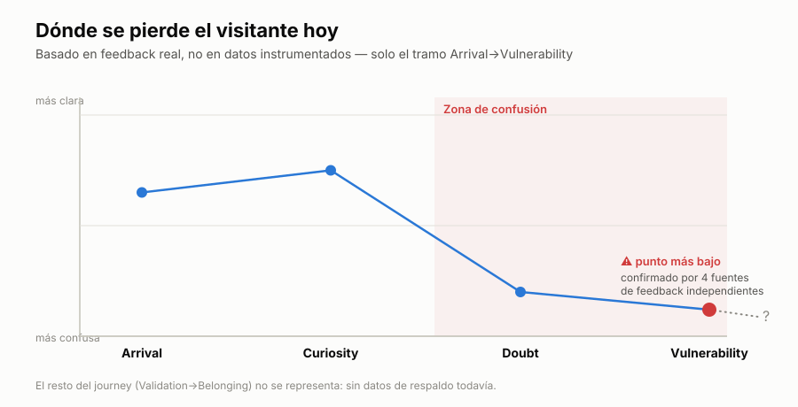

# Refugio — Workshop Update

## What this is

A single diagnostic chart: where a first-time visitor loses clarity today,
grounded only in real feedback we've already collected — no invented metrics,
no borrowed research citations dressed up as if they measured Refugio directly.

## Why this shape, and only this shape

This started from a broader "emotional impact" comparison chart that also claimed
a recovery arc (Refugio ending happier than gamified apps) and cited two named
protocols. On closer check, the recovery arc and the named protocols didn't hold
up — see the full breakdown for what's real vs. invented. This chart keeps only
the one part that survived scrutiny: the early drop in clarity between arrival
and the first real interaction.

## What it's grounded in

Four independent feedback sources — collected separately, at different times,
through different channels — all point at the same stretch: a visitor arrives,
something (the visuals, the sound) lands well in the first seconds, and then
confusion sets in before they understand what to do or why. One source described
almost leaving before understanding the app. Another disengaged specifically from
the Home screen. A third reported anxiety from the lack of clear direction. A
fourth got lost specifically in Observe. None of these people talked to each
other; the pattern repeated on its own.

## What's deliberately left out

- **No numbers on the y-axis.** We don't have instrumented data on how visitors
  actually feel stage by stage — only that clarity drops and where. Plotting a
  precise value would overstate what we know.
- **No recovery arc.** Whatever happens after a visitor gets past the confusion
  point isn't something we have feedback or data on yet. Drawing a plausible
  climb back up would be decoration, not signal.
- **No comparison to "traditional apps."** That framing needs its own
  substantiated research pass if it's ever worth making — it wasn't load-bearing
  for what this chart needs to say.

## Why now

This is the diagnostic behind the cold-arrival work already in progress
(`arrival-intro.tsx`, `home-gate.tsx`) — the chart names precisely the gap that
work is trying to close.
